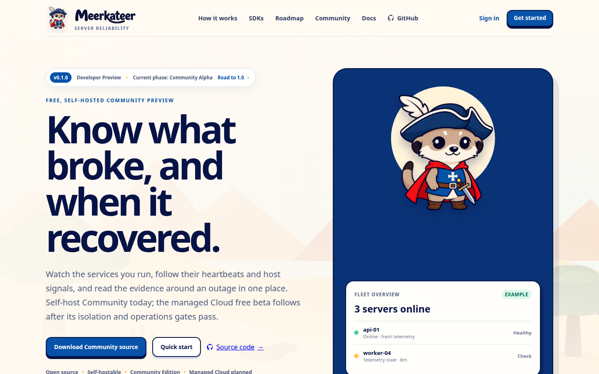
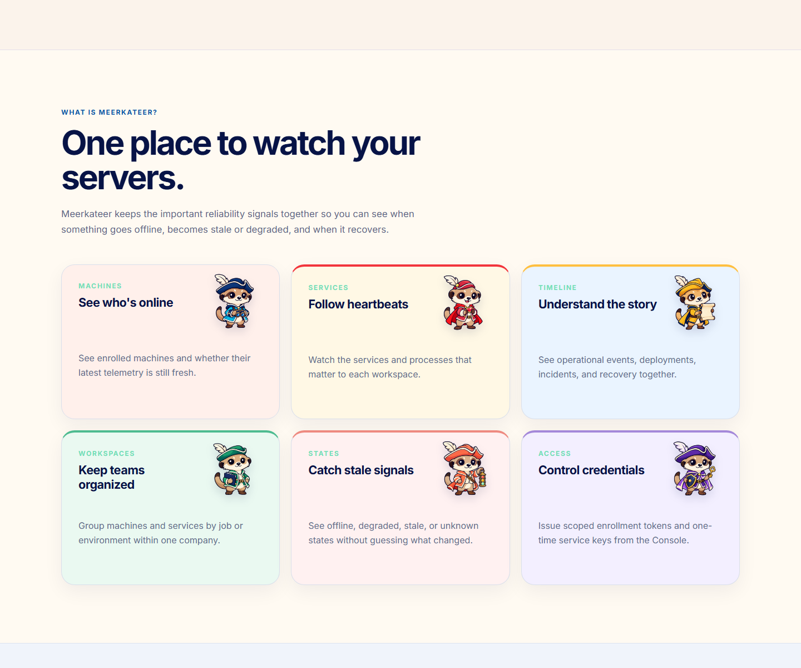
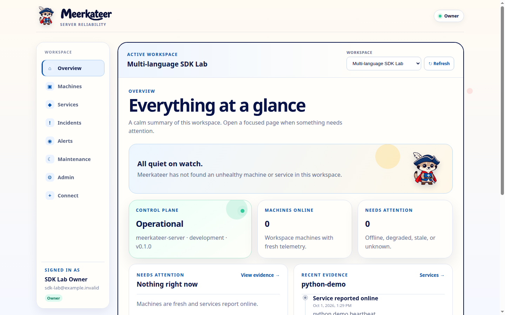
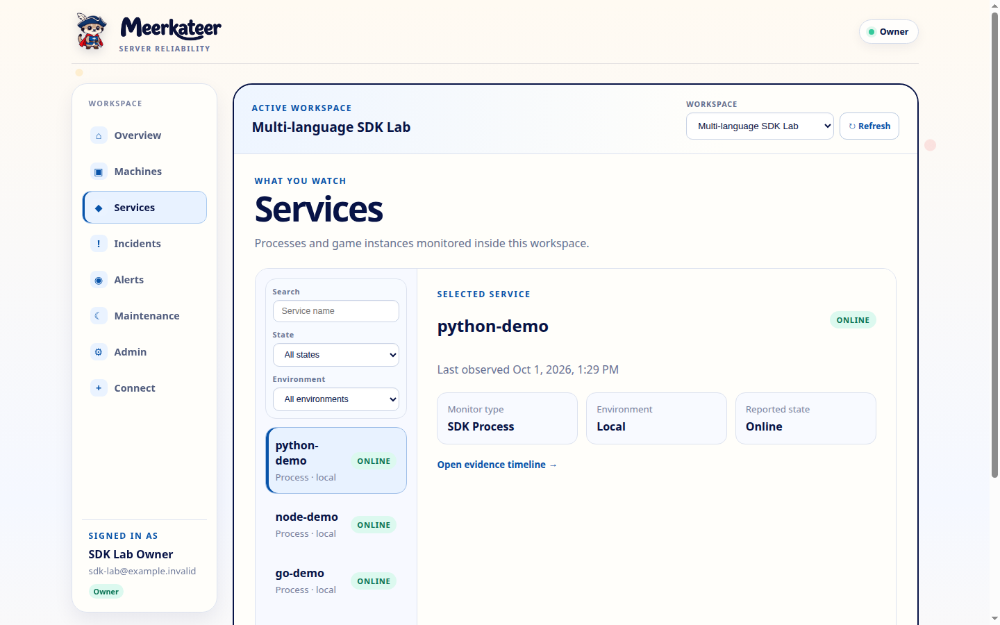
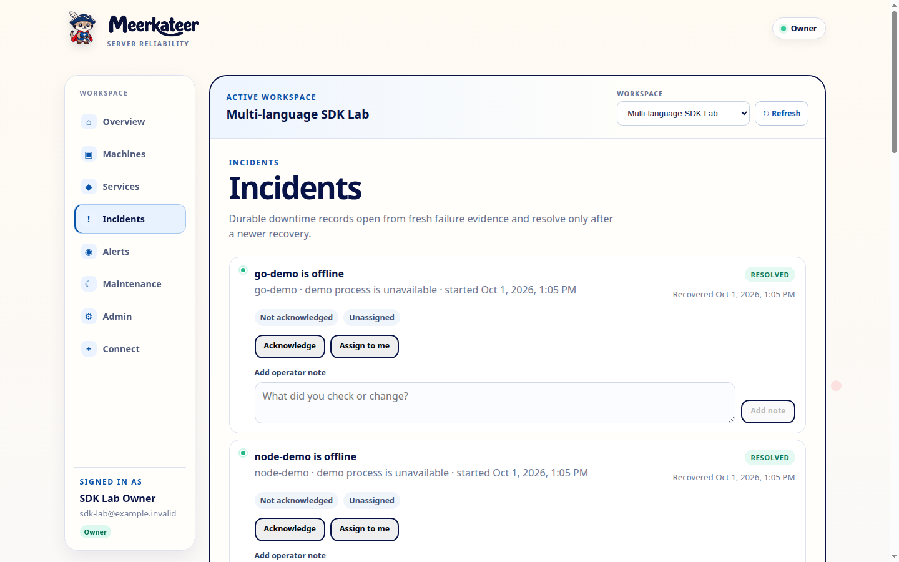

<p align="center">
  
</p>

<h1 align="center">
  
</h1>

<h3 align="center">A friendly lookout for the servers your team depends on.</h3>

<p align="center">
  Free and open source &nbsp;•&nbsp; Self-hosted &nbsp;•&nbsp; Apache-2.0
</p>

<p align="center">
  <a href="#quick-start">Quick start</a> &nbsp;•&nbsp;
  <a href="docs/roadmap-to-1.0.md">Roadmap</a> &nbsp;•&nbsp;
  <a href="docs/agent-cli.md">Connect a machine</a> &nbsp;•&nbsp;
  <a href="docs/localhost-sdk-guide.md">Connect an app</a>
</p>



## Meet Meerkateer

When a game server or business app goes quiet, Meerkateer helps you answer three questions quickly:

1. **What stopped working?** See unhealthy machines, processes, and services in the workspace where
   they belong.
2. **What happened around the failure?** Follow fresh telemetry, status changes, incidents, notes,
   alerts, and maintenance context in one place.
3. **Did it really recover?** Keep the down and recovery evidence together instead of guessing from
   a green light.

Meerkateer is designed for game-server communities, small businesses, homelabs, and operations
teams that want useful reliability evidence without beginning with an enterprise-sized setup.

### What you get today

- One company can organize many workspaces, and every workspace can contain many machines and apps.
- A lightweight Rust agent watches host health and the exact processes you choose.
- Rust, Node.js, Python, Go, and PHP SDKs send application heartbeats, events, and deployments.
- The Console shows outages, recovery, incidents, alert history, maintenance, and audit activity.
- Community Edition runs on your own infrastructure with no billing or remote-license dependency.



The current pilot is **Community-first**. Meerkateer Cloud is planned for teams that would rather
not operate the platform themselves, but self-hosting stays a complete open-source product.

## See the real Console

These are real screens from the disposable five-language SDK lab—not design mockups. The lab sends
telemetry from Rust, Node.js, Python, Go, and PHP, deliberately reports failures, and then recovers
them so the same evidence path can be checked end to end.

### One workspace at a glance



### Real services from five SDK languages



### Failure detection and durable recovery incidents



The interface is intentionally cute, clear, and quiet, while operational details remain visible
where an operator needs them. The screenshots can be reproduced with
`scripts/multilang-sdk-lab.sh` and `tests/integration/multilang_sdk_lab.py`.

The [UI product plan](docs/ui-product-plan.md) explains the complete information architecture and
accessibility goals. The [Community delivery plan](docs/community-first-roadmap.md) records what has
repeatable evidence and what still needs work. The Minecraft Java / Paper adapter is experimental;
its [game-server beta plan](docs/game-server-beta.md) is currently paused.

## Current version

| | |
| --- | --- |
| Code version | **0.1.0** |
| Release channel | **Developer Preview** |
| Current delivery phase | **0.2 Community Alpha** |
| Stable target | **1.0.0 Community** |

`0.1.0` is the version declared in the Rust workspace and web package. A signed `v0.1.0`
GitHub Release has not been published yet. See the canonical
[roadmap to 1.0](docs/roadmap-to-1.0.md) for milestone scope and measurable exit gates.

> **Status: developer preview.** Phases 0 and 1 are complete. Phase 2 now has the
> tenant/RLS boundary, bootstrap session, inventory, service-key lifecycle, and agent
> enrollment/rotation/revocation. Phase 3 has durable MKS/MKA ingestion, first-class incidents with
> acknowledgement/assignment/notes, audited alert policy/history/cooldown/dead-letter replay,
> maintenance-window foundations, and visible background-worker progress, but production OIDC,
> advanced routing/escalation, and the production security gates are
> not complete. Do not expose this build to untrusted networks.

## Product modes

- **Meerkateer Community** is the complete self-hosted Apache-2.0 product: one company per
  installation, with many workspaces, machines, members, and monitored services. It has no billing,
  hosted-account, or remote-license dependency.
- **Meerkateer Cloud** is the planned managed, multi-tenant service. It runs pinned releases of the
  same public core and adds hosted provisioning, regions, quotas, operations, and support. The free
  hosted beta begins only after the Community operations foundation; it is not currently available
  and does not block Community 1.0.

Both modes use the same open-source core. The initial product monitors reliability; it
does not provide arbitrary remote commands, RCON administration, game provisioning, or
raw player/chat collection.

The repositories are deliberately not forks. Public `theparitt/meerkateer` owns the core, agents,
SDKs, Console, migrations, tenant boundary, and Community packaging. Private
`theparitt/meerkateer-cloud` owns only the hosted provisioner, provider infrastructure, account and
operator portals, regional operations, quotas, support, and later billing. Cloud consumes signed,
versioned public images by digest; public core never imports private Cloud code. See the complete
[Community and Cloud repository boundary](docs/repository-and-cloud-boundary.md).

## Road to 1.0

| Milestone | Outcome | State |
| --- | --- | --- |
| `0.1` Foundation preview | Multi-workspace core, durable ingest, SDKs, agent, Console, test labs, and deploy packaging | Current code |
| `0.2` Community Alpha | Clean failure → evidence → alert → recovery journey | In progress |
| `0.3` Monitoring Alpha | Production agent collectors, probes, and initial game/SME adapters | Planned |
| `0.4` Security Beta | Multi-user access, complete tenant tests, abuse controls, signed config, security review | Planned |
| `0.5` Operations Beta | Restore, upgrade, retention, alert operations, observability, and fault drills | Planned |
| `0.6–0.7` Public/Scale Beta | Signed artifacts, clean install, accessibility, capacity, compatibility, and soak | Planned |
| `0.8` Hosted Beta | Free managed beta; parallel and non-blocking for Community | Planned |
| `0.9` Release Candidate | Feature freeze, independent review, upgrade/restore rehearsal, 14-day operator soak | Planned |
| `1.0` Stable | Supported Community release with published security, platform, capacity, and recovery contracts | Target |

Stripe billing is not a Community 1.0 gate. Hosted service billing remains a later commercial
milestone after the free hosted beta proves operations and real cost. The detailed roadmap lists
the work, test plan, adversarial and edge cases, exit evidence, critical path, approximate planning
ranges, and explicit 1.0 exclusions. A phase closes only when repeatable evidence is linked from
[delivery status](docs/phase-status.md); completing its feature list or passing unit tests alone is
not sufficient.

## Company and workspace model

- A **tenant** is one company and is the security, membership, and future billing boundary.
- A **project** is shown to operators as a workspace: one job or managed environment inside
  that company.
- An **agent** is one enrolled machine. A workspace can contain many machines, and a shared
  machine can be assigned to more than one workspace without duplicating its identity.
- A **service** is a monitored game server, SME application, or dependency inside a workspace.

Workspace-scoped enrollment tokens attach a newly enrolled machine automatically. Existing
company machines can also be assigned to or removed from a workspace without revoking them.

<a id="quick-start"></a>

## Quick start

Requirements: Docker Engine 26+ with Compose v2, `make`, and OpenSSL.

```sh
make dev
```

Open <http://127.0.0.1:6511> when the containers are healthy. The API listens on
<http://127.0.0.1:6510>. Run `make smoke` to confirm the complete local path, and `make down` when
you want to stop it without deleting its PostgreSQL data.

<details>
<summary><strong>Prefer an AI coding assistant? Copy this safe installation prompt.</strong></summary>

### AI installation prompt

Copy the prompt below into Codex, Claude Code, Cursor, or another coding assistant that has a
terminal in this repository. It gives the assistant a bounded, repeatable job and prevents it from
deleting the database or exposing credentials.

```text
Install and verify Meerkateer Community from the current repository.

Goal:
- Run the free self-hosted Community product locally.
- Web must be available at http://127.0.0.1:6511.
- API must be available at http://127.0.0.1:6510.
- Keep any existing company, workspaces, machines, services, and PostgreSQL data.

Safety rules:
- Read README.md and docs/ai-localhost-runbook.md before changing anything.
- Never print, summarize, copy into chat, or commit .env values, setup keys, service keys,
  enrollment tokens, cookies, or database passwords.
- Never run docker compose down --volumes, delete a named volume, or recreate PostgreSQL data.
- Do not enable Stripe, Meerkateer Cloud, public internet exposure, or remote access.
- Preserve unrelated working-tree changes. Diagnose before editing source code.

Procedure:
1. Check Docker, Docker Compose v2, make, and OpenSSL. Report a missing dependency clearly.
2. Run make bootstrap. It is allowed to create .env only when it does not exist.
3. Run make migrate to start the dedicated PostgreSQL 18 database and apply every migration.
4. Run docker compose up -d --build --wait.
5. Run make smoke.
6. Verify docker compose ps, GET http://127.0.0.1:6510/ready, and the web response at
   http://127.0.0.1:6511. Inspect only relevant container logs if a check fails.
7. Do not claim success unless all health checks pass. Report the containers, URLs, migration
   result, smoke-test result, and any remaining warning without revealing secrets.
8. Tell me to open http://127.0.0.1:6511/login. For a new database I should choose First setup
   and paste MEERKATEER_BOOTSTRAP_TOKEN directly from my private .env file myself. Never ask me
   to paste that value into chat. Existing installations should use Sign in; Recover is only for
   setting or replacing the owner password.
```

After signing in, this second prompt asks an assistant to guide machine or process onboarding
without handling the one-time credentials itself:

```text
Help me connect one machine or application to my running Meerkateer Community installation.
First ask whether I need (A) the machine agent or (B) an application SDK, and for an SDK ask for
the language: Rust, Node.js, Python, Go, or PHP. Use the workspace I select in the Console. Give
commands for localhost API http://127.0.0.1:6510, but never ask me to paste an enrollment token or
service key into chat and never place a secret directly in a command-line argument. Have me enter
it privately into an environment variable. Finish by sending healthy telemetry, simulating one
safe failure, recovering it, and verifying the Console timeline shows down and recovered states.
Use docs/localhost-sdk-guide.md and docs/ai-localhost-runbook.md as the source of truth.
```

</details>

The first run creates a mode-`0600` `.env` with random local credentials, builds
non-root containers, initializes PostgreSQL 18, and starts:

- web console: <http://127.0.0.1:6511>
- API: <http://127.0.0.1:6510>
- OpenAPI: <http://127.0.0.1:6510/openapi.json>

In a second terminal, run `make smoke`. Stop the stack with `make down`. To use an
existing PostgreSQL 18 instance, keep a dedicated database and role and set
`MEERKATEER_DATABASE_URL`; see [the storage deployment boundary](docs/deployment/storage.md).

Run `make failure-lab` to start a separate disposable database and fake service,
trigger real HTTP and process failures, and verify status, alerts, retries and
recovery. See the [failure lab guide](docs/failure-lab.md) for the fault list and
isolated ports. Run `make control-plane-lab` to separately exercise API and
database outage recovery.

Run `make sdk-lab` to open a disposable workspace containing real Python, Node.js,
Go, PHP, and Rust demo servers. Run `make sdk-lab-test` to drive all five through
degraded, down, recovery, stopped-process detection, and restart recovery. See the
[localhost SDK guide](docs/localhost-sdk-guide.md); automated coding agents should
follow the [AI localhost runbook](docs/ai-localhost-runbook.md).

Open the web console. On a new database, create the company and owner with the
`MEERKATEER_BOOTSTRAP_TOKEN` value from the private `.env` file and an owner password of at least
12 characters. Later visits use the owner's email and password at `/login`. The same page contains
three clearly labelled modes: **Sign in** for daily use, **First setup** for a new database, and
**Recover** for setting or replacing the owner password. Old `/setup` and `/recover` links remain
compatible but open this single access screen. The setup key remains a recovery credential and
must stay private. Community sign-in is rate-limited, audited, and unavailable in Cloud mode.
Before starting an existing installation with this version, back up its database and run
`make migrate` to apply the workspace-assignment, password, Minecraft-instance, and operations
migrations without changing
existing companies or sessions.

To test outage and recovery notifications, set `MEERKATEER_ALERT_WEBHOOK_URL` in
the private `.env` to an HTTPS endpoint that accepts JSON with a `content` field.
Restart the API and worker, then choose **Send test alert** in the Console.
Loopback HTTP is allowed only for local tests. Service heartbeats reporting down
and recovery enqueue transition alerts; repeated or older observations do not
create another alert. The worker retries failed delivery and eventually moves
it to the dead-letter queue. This is an early single-channel workflow; alert
confirmation and maintenance policies are tracked in CE-3.

## Experimental Minecraft Java / Paper adapter

In the Console, create a workspace, open **Manage workspaces, machines, and processes**,
choose **Minecraft Java / Paper**, and enter the game's public DNS name or IP address
and Java port (usually 25565). Each game instance is its own service, independent of
the machine hosting it. Select the instance and click **Test game status now**. The
manual test reports version, server-reported player counts, and response time from the
Community control plane. It does not prove player login or gameplay, does not save an
uptime record, and does not send alerts. Private or reserved destinations are blocked;
Cloud probing stays disabled until separate network egress controls are in place.

For development without containers:

```sh
cargo run --locked -p meerkateer-server
cd meerkateer-web && npm ci --ignore-scripts && npm run dev
```

## Enroll a machine

In the Console, select a workspace, open **Manage workspaces and machines**, and issue a
ten-minute enrollment token. On the machine being monitored, place the token in the
environment without putting it in a command-line argument, then enroll and start the agent:

```sh
read -rsp 'Enrollment token: ' MEERKATEER_ENROLLMENT_TOKEN && export MEERKATEER_ENROLLMENT_TOKEN
cargo run --locked -p meerkateer-agent -- enroll --server http://127.0.0.1:6510 --name game-host-01
cargo run --locked -p meerkateer-agent -- doctor
cargo run --locked -p meerkateer-agent -- inspect --watch-process java
cargo run --locked -p meerkateer-agent -- run --watch-process java
```

The agent requires HTTPS for non-loopback servers, follows no redirects, and stores its
credential plus durable sequence/retry state in an atomically replaced config file (mode `0600`
on Unix). It reports bounded CPU, memory and fixed-filesystem metrics plus exact-name process
instance counts; it does not collect command lines, environment variables, usernames, paths, PIDs,
or file contents. The same CLI builds on Linux and Windows. See the
[host agent CLI guide](docs/agent-cli.md) for native build commands, PowerShell enrollment,
privacy boundaries, one-shot use, and acceptance checks.
Use `--config PATH` before the subcommand when running multiple local agent identities.
For unattended startup, use the preview [Linux systemd installer](packaging/systemd/README.md) or
[Windows background-agent installer](packaging/windows/README.md). Enroll first; neither installer
accepts a secret on its command line.

The Console can view the latest telemetry from agents on other reachable machines. Remote execution
is intentionally disabled: the current protocol exposes no inbound listener or command channel. A
future restart feature must satisfy the typed, locally allowlisted, signed and audited design in
[ADR-0008](docs/adr/0008-bounded-remote-recovery.md); arbitrary shell access is out of scope.

## Add a process or application

Inside a workspace, open **Manage workspaces, machines, and processes**, create the process,
and copy the SDK key shown once. Choose Node.js, Go, Rust, Python, or PHP and use the
environment block shown by the Console. For example, install the Python SDK:

```sh
python3 -m pip install ./sdk/python
python3 examples/python/basic_monitor.py
```

Application code can report health and operational facts directly:

```python
from meerkateer_sdk import Meerkateer

client = Meerkateer.from_env()
client.heartbeat("ok", message="game loop healthy")
client.event("matchmaker_unavailable", level="error", message="dependency unavailable")
client.deploy("1.2.3", "abcdef123456", status="finished")
```

Rust services can use the typed async SDK from this workspace:

```toml
[dependencies]
meerkateer-sdk = { path = "../meerkateer/sdk/rust" }
```

```rust
use meerkateer_sdk::{HeartbeatStatus, Meerkateer};

let client = Meerkateer::from_env()?;
client.heartbeat(HeartbeatStatus::Ok, None).await?;
```

See the [Node.js SDK](sdk/node/README.md), [Go SDK](sdk/go/README.md),
[Rust SDK](sdk/rust/README.md), [Python SDK](sdk/python/README.md), and
[PHP SDK](sdk/php/README.md) guides.
A computer uses the outbound host agent; a process/service uses an SDK key. Both appear
under the selected workspace.

## Repository status

The repository now contains:

- draft, machine-tested MKS-1 and MKA-1 contracts with positive/negative fixtures;
- a Rust workspace for API, worker, agent, domain, protocol, configuration, and storage
  boundaries;
- a React/TypeScript operator-console skeleton with a checked OpenAPI boundary;
- PostgreSQL 18 migration and deterministic development seed;
- one-time bootstrap, company-scoped workspace/service inventory, many-to-many workspace
  machine assignment, CSRF-protected mutations, and auditable credential lifecycle APIs;
- authenticated, idempotent MKS heartbeat/event/deploy and MKA telemetry ingestion
  with atomic outbox writes, sequence-gap evidence, and privacy guards;
- a working cross-platform outbound agent enrollment/doctor/inspect/run lifecycle with bounded
  CPU, memory, filesystem and exact-name process collection, secure local credential persistence,
  and exact-batch retry across restarts;
- Node.js, Go, Python, PHP, and typed async Rust SDKs with bounded transport, retry
  idempotency, and heartbeat/event/deployment helpers; Python and Rust also have real
  API E2E coverage;
- service inventory reads that expose reported and effective state and fail stale
  heartbeat observations safely to `unknown`;
- an authenticated operator dashboard with workspace switching, machine connection state,
  workspace/machine management, one-time enrollment tokens, service status, visual heartbeat
  history, outage/recovery reasons, events, deployments, and a tenant-scoped per-machine host
  snapshot with CPU/memory/disk gauges plus watched-process failure evidence;
- lease-based multi-worker outbox delivery with bounded exponential retry, poison-message
  DLQ, and a database login that cannot read tenant tables directly;
- non-root development containers and a Compose topology with generated credentials;
- policy, contract, unit, migration, web, lint, and secret-scanning CI gates; and
- the phased production roadmap and architecture decisions.

Follow [the milestone status](docs/phase-status.md),
[commercial release phases](docs/commercial-readiness-plan.md), and
[technical roadmap](docs/production-roadmap.md) for remaining scope and release gates.

## Quality commands

```sh
make test
make lint
make integration
```

## Package for deployment

The web console deploys to Cloudflare Workers with `cd meerkateer-web && npm run deploy`.
The API and background worker publish as versioned GHCR images with
`make publish-images VERSION=<immutable-tag>`. Production Compose keeps the API on loopback,
uses a dedicated PostgreSQL 18 volume, and is intended to sit behind Cloudflare Tunnel.

Follow the complete [Cloudflare, GHCR, and production-host runbook](docs/deployment/cloudflare-ghcr.md)
before using these commands. Packaging is repeatable, but the project remains a developer
preview until the open release gates in [the milestone status](docs/phase-status.md) pass.

## Security and privacy principles

- deny-by-default tenant boundaries;
- outbound-only agent communication;
- no shared fleet credential or plaintext stored service key;
- bounded parsing, collection, queues, labels, and payloads;
- bounded node-local authentication/ingestion rates; production proxies must also enforce
  distributed limits because the application intentionally ignores spoofable forwarding headers;
- no player names, player identifiers, chat, IP addresses, database rows, or query text
  in telemetry; and
- no entitlement decision based only on a browser redirect.

See [SECURITY.md](SECURITY.md) before reporting a vulnerability.

## Contributing

Contributions are welcome after reading [CONTRIBUTING.md](CONTRIBUTING.md),
[GOVERNANCE.md](GOVERNANCE.md), and the [Code of Conduct](CODE_OF_CONDUCT.md).
Contributions require a Developer Certificate of Origin sign-off.

## License

Copyright 2026 The Meerkateer Authors.

Licensed under the [Apache License, Version 2.0](LICENSE). The license covers the
software and documentation, not the Meerkateer names or logos; see
[TRADEMARKS.md](TRADEMARKS.md).
